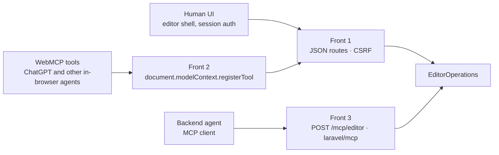

# SiteWorks WebMCP demo

## What this is

SiteWorks is a site builder: a public storefront and a signed-in client portal where the owner edits pages, brand, and (when enabled) a shop. This repository is a cut-down public copy of that platform, seeded with one fictional bakery — Camino Bakehouse — on SQLite, with no Postgres, Redis, S3, or AI service.

On top of that storefront and portal sits the WebMCP layer. An agent running in the browser (ChatGPT’s in-app browser, or Chrome with the WebMCP flag) can register tools on the editor parent page, read the live draft (structure, brand, catalogue), and write draft edits. Content and catalogue changes are draft-first: they land in the site's draft and publishing stays a human action. A small set of configuration tools (`assign_media`, `set_fulfilment`, `update_asset_metadata`, the shop-chrome knobs, and the snapshot rebuild inside `draft_category_content`) write live site settings directly and say so in their descriptions — none of them publish page or product content, and nothing the agent can call publishes a page or a product. The same operations layer serves the human UI, the in-page tools, and an optional MCP HTTP server.

## Try it

Docker is the only dependency.

```bash
docker compose up
# or: bin/demo up
```

Then open:

| Surface | URL |
|---|---|
| Storefront | http://localhost:8090 |
| Client portal | http://app.localhost:8090 |

Portal login (from [`.env.demo`](.env.demo), seeded on first boot):

- Email: `demo@camino.example`
- Password: `webmcp-demo`

A first boot recorded storefront HTTP 200 containing `Camino Bakehouse` and a Playwright login to `http://app.localhost:8090/sites/64/design`.

**Agent host:** ChatGPT desktop in-app browser, or Chrome 149 with `chrome://flags/#enable-webmcp-testing`.

### Using it from ChatGPT (start here)

- Use the **ChatGPT desktop app's in-app browser** (⌘⇧B) with model **GPT-5.6 Sol or Terra** — site tools are not discovered on other model tiers.
- Site tools are **not available in Enterprise or Edu workspaces**; use a Plus/Pro/Team account.
- If no tool arrow appears in the address bar, check **Settings → Browser → Permissions** — site tools can be toggled off per site.
- Verified against ChatGPT desktop (macOS) version 26.901.20858 (released 2 Sep 2026), model **GPT-5.6 Sol Light** ("Powered by Codex & OWL"), on 3 Sep 2026. In Chrome, use Chrome 149+ with `chrome://flags/#enable-webmcp-testing`.
- Hosted copy of this repo (no Docker needed): **https://webmcp-demo.siteworks.cloud** — portal at https://webmcp-demo-app.siteworks.cloud/login, credentials as above.
- The hosted demo resets daily around 11:00 UK — anything you draft or publish there is temporary. Sample inputs to recreate the video's import are in `demo/sample-inputs/`.
- The tools register on the portal's Pages, Design and Products pages, not on the storefront: the site overview registers the read set (8 tools), Products the shop set (17 tools, including `import_products`). In the browser console, `window.__siteworks_webmcp__.sync()` forces a re-registration.

**Between-takes reset (hosted demo):** the container keeps a snapshot of the seeded database and media. `php artisan demo:reset-fast snapshot` takes it on a clean seed; `demo:reset-fast reset` restores it in about a second; `demo:reset-fast assert` prints the state. With `DEMO_RESET_TOKEN` set, `GET /demo/reset?token=…` on the **portal host** does the same (the storefront host routes every path to the site renderer) (`&assert=1` for state only); without the token the route is a 404.

Chrome resolves `*.localhost` to loopback. Safari and Firefox may need:

```
127.0.0.1 app.localhost
```

nginx accepts any `Host` on port 8090; the app picks storefront vs portal from that header (`sites.preview_domain` for the bakery, `APP_PRIMARY_DOMAIN` for the portal). Stop with `bin/demo down`. `bin/demo reset` deletes the named volumes (`demo-data` for SQLite, `demo-media` for statically served media, `demo-private` for customer personalisation images, which are only served through a signed route).

## What the agent can do

Front 2 registers each operation in [`resources/js/site-editor/webmcp/schemas.json`](resources/js/site-editor/webmcp/schemas.json) as `siteworks.<operation>`, plus one extra tool `siteworks.navigate_preview` that is not in the schema file. The site’s exposure allowlist (seeded server-side) can narrow the set; the tables below are the schema catalogue, grouped by `skill_*` vs `readOnly`. Generated from that file; 55 operations (19 read, 33 write, 3 skills). AI generation operations (`generate_image`, `generate_logo_concepts`, `regenerate_hero`, `manage_video`) are not in this demo.

The demo client user sees the portal and shop exposure sets (8 tools on the site overview, 17 on Products). Rows marked *Staff only* exist in the catalogue but are never registered for a client session, in the demo or in production.

**On the storefront**, the quote page (`/shop/quote`) registers two tools of its own for the shopper's browser agent, from [`resources/js/shop/webmcp-quote.js`](resources/js/shop/webmcp-quote.js): `siteworks.get_quote_form` (read-only — the form's fields, labels, options and which are required) and `siteworks.prefill_quote` (fills the form in the browser from what the shopper asked for: name, contact details, fulfilment method, dates, and anything the form has no field for as readable lines in `message`; its input schema is derived from the rendered form and rejects unknown keys). Neither tool talks to the server, and no tool ever submits the form: the shopper reviews what was filled and presses **Request a quote** themselves. When the browser exposes a model context the page shows a small "an agent can fill this form" hint above the form; otherwise nothing changes.

### Read

| Tool | What it does |
|---|---|
| `siteworks.describe_import_products` | Describes the import_products contract: canonical fields, per-format examples, and limits. Read-only; writes nothing |
| `siteworks.export_products` | Exports the CURRENT merchant catalogue as a downloadable csv/md/json file via a short-lived signed URL (5-minute expiry). Read-only: makes no draft changes, does not publish, and does not rebuild the snapshot. The tool response never carries the catalogue itself, only a download_url |
| `siteworks.get_brand_context` | Reads the brand profile as captured (palette, fonts, tone) plus current draft hero and logo URLs. For the EFFECTIVE palette, text-safe contrast colours, and design tokens the renderer actually applies, use get_brand_system instead |
| `siteworks.get_brand_system` | Reads the effective brand palette, text-safe contrast colours, fonts, layout tokens, and design-brief rationale — the source of truth for the site's colours and design system as rendered (get_brand_context returns the raw captured profile instead). Makes no draft changes |
| `siteworks.get_draft_diff` | Reads unpublished page, composition, and asset-selection diffs. Values are truncated at 512 bytes; media bytes are never returned. Never publishes |
| `siteworks.get_effective_hero_state` | Reads published-effective and draft-effective hero state and why that asset won. `section_field` and `placeholder` are reported from the hero section, not from the shared page image map |
| `siteworks.get_job_status` | Reads async generation job status |
| `siteworks.get_logo_assets` | Reads the site's selected logo and any stored variants, minting short-lived signed download URLs. Makes no draft changes |
| `siteworks.get_page_structure` | Reads the draft page section structure without changing it |
| `siteworks.get_site_context` | Reads this site's identity, shop flags, and the tool names this actor may call on this surface |
| `siteworks.get_video_state` | Lists hero video versions with active and drafted state and persisted probe metadata. reduced_motion_fallback is always none because the hero markup has no prefers-reduced-motion gate. Never probes and never dispatches |
| `siteworks.inspect_draft` | Composes unpublished diffs and pre-publish findings; never triggers a capture and carries no screenshot flag. Never publishes |
| `siteworks.list_image_versions` | Lists hero, logo, or media versions for a site |
| `siteworks.list_media` | Reads the site media library (non-provisional assets) with the same filters as the library grid |
| `siteworks.list_theme_token_presets` | Lists named theme token presets (name, description, token count). Staff only |
| `siteworks.publish_summary` | Reads pending publish summary; never publishes |
| `siteworks.get_product` | Reads one catalogue product. This does not publish anything — draft products stay hidden on the live site until a human publishes them |
| `siteworks.list_products` | Reads the merchant catalogue. Drafts stay hidden on the live storefront until a human publishes them |
| `siteworks.validate_draft` | Reads structured pre-publish findings without publishing or fetching external URLs; some section variants paint literal colours a theme write cannot move |

### Write

| Tool | What it does |
|---|---|
| `siteworks.add_section` | Adds a section to the page draft |
| `siteworks.apply_theme_token_preset` | Copies a named token preset onto the draft composition under existing site keys. Staff only; does not publish |
| `siteworks.assign_media` | Assigns a library asset to a live chrome slot (brand_row). Writes sites.brand_image_media_id and keeps brand_image_path in sync; does not publish a draft |
| `siteworks.draft_category_content` | Updates draft category copy, FAQs, and metadata for this site. The shop snapshot rebuild publishes the rendered storefront state |
| `siteworks.edit_field` | Writes a single draft field on a page section |
| `siteworks.import_products` | Imports catalogue products as drafts from json, csv, or md. This does not publish anything — every imported product stays hidden on the live site until a human publishes it. Committing (dry_run false) requires a fresh idempotency_key: a reused key returns the earlier commit's receipt instead of importing again |
| `siteworks.manage_category` | Creates, moves, or deletes a catalogue category. This does not publish anything — the live storefront updates when the shop snapshot rebuilds |
| `siteworks.move_section` | Reorders a section in the page draft |
| `siteworks.remove_section` | Removes a section from the page draft |
| `siteworks.restore_image_version` | Writes a draft hero or logo selection; does not activate it |
| `siteworks.restore_media_version` | Assigns a previous site media version to a draft field |
| `siteworks.save_theme_token_preset` | Snapshots the current site token_overrides as a named preset. Copy, do not link. Staff only; does not mutate the draft |
| `siteworks.seed_product_reviews` | Bootstraps a new store with clearly-marked seeded reviews (source: seed, shown as such). Staff only; not exposed to agents in this demo. Does not enable the public review form |
| `siteworks.select_logo` | Writes a draft logo selection; does not flip is_selected |
| `siteworks.set_fulfilment` | Writes the live sites.fulfilment JSON (delivery zones, collect, shipping, widget). Does not publish a draft |
| `siteworks.set_hero_copy_style` | Writes the live sites.hero_copy_style chrome knob (preset\|plain\|panel\|boxed). Does not publish a draft |
| `siteworks.set_logo_media` | Creates an unselected uploaded logo concept from site media and writes only the draft selection; does not flip is_selected |
| `siteworks.set_nav_container` | Writes the live sites.nav_container_style and sites.nav_container_fill chrome knobs. Does not publish a draft |
| `siteworks.set_nav_label` | Writes the drafted composition nav item label for a page. Never writes generated_pages.nav_label |
| `siteworks.set_section_style` | Merges operator style_overrides onto a section instance in the page draft. Staff only; does not publish. Also accepts per-section texture tokens: texture (library key, none, or image), texture_opacity (0.01–0.5), texture_size (sm\|md\|lg), texture_image_path (site media path), texture_image_mode (tile\|cover) |
| `siteworks.set_shop_index_blocks` | Writes the live sites.shop_index_blocks list of product rows and trust strips under a blocks_revision compare-and-swap. Does not publish a draft |
| `siteworks.set_theme_tokens` | Merges operator token_overrides into the draft composition theme. Staff only; does not publish |
| `siteworks.set_title_emphasis` | Writes title emphasis ranges on a page section, atomically with an optional title |
| `siteworks.set_variant` | Sets a section variant on the page draft |
| `siteworks.draft_product` | Creates a draft catalogue product with priced variants. This does not publish anything — the product stays hidden on the live site until a human publishes it |
| `siteworks.set_product_image` | Attaches an existing site media object to a draft product. This does not publish anything and never accepts image bytes |
| `siteworks.update_draft_product` | Updates a draft catalogue product. Published and archived products are refused. This does not publish anything |
| `siteworks.undo_revision` | Writes a new draft revision restoring the current draft's recorded parent; never moves published_revision_id |
| `siteworks.update_asset_metadata` | Updates the live site_media row (alt text, caption, attribution, role, focal point). This change is not drafted: editor metadata writes do not invalidate the public cache, so it lands on the next uncached public render rather than instantly repainting cached HTML |
| `siteworks.update_brand_theme` | Writes colour/typography override tokens into the draft composition theme; contrast-gated |
| `siteworks.update_form` | Replaces a form section definition on the draft |
| `siteworks.update_page_settings` | Writes draft page SEO meta_title and meta_description into the page revision. Rejects slug, page_type, status, visibility, canonical_url and social_image. Does not publish |
| `siteworks.upload_image` | Ingests site media and optionally assigns it to a draft image field; hero-family background assignments also register an inactive hero version and make it the drafted hero selection |

### Skills

| Tool | What it does |
|---|---|
| `siteworks.skill_add_product_with_imagery` | Protocol for adding a single product with images |
| `siteworks.skill_export_catalogue` | Protocol for exporting this store's catalogue and brand for use elsewhere |
| `siteworks.skill_import_catalogue_from_source` | Protocol for turning a merchant's flyer, price list or document into draft products |

## Where the WebMCP code is

**registerTool** — [`resources/js/site-editor/webmcp/tools.js:607`](resources/js/site-editor/webmcp/tools.js) (host lookup at line 621):

```js
const mc = document.modelContext ?? navigator.modelContext;
if (! mc?.registerTool) {
    return;
}
// … (line 607, inside the per-tool registration loop)
document.modelContext.registerTool(def, { signal: controller.signal });
```

**Server route (browser / Front 2):** `POST /sites/{site}/operations/{operation}` in [`routes/editor-shell.php`](routes/editor-shell.php) (line 69), handled by `EditorOperationController::operation`. Calls carry `X-Editor-Channel: webmcp`.

**Server route (MCP HTTP / Front 3):** `POST /mcp/editor` in [`routes/mcp.php`](routes/mcp.php) → [`app/Mcp/Servers/EditorMcpServer.php`](app/Mcp/Servers/EditorMcpServer.php). Registered from [`bootstrap/app.php`](bootstrap/app.php) when `EDITOR_AGENT_TOOLS` is on (host-unbound; portal session required).

**Operation layer:** [`app/Services/Site/Editor/EditorOperations.php`](app/Services/Site/Editor/EditorOperations.php). SitePolicy, AgentToolsGate, exposure sets, draft-first writes (the live-state exceptions are listed above), one `editor_operation_log` row per call.

**Approval envelope:** [`app/Services/Site/Editor/ApprovalStore.php`](app/Services/Site/Editor/ApprovalStore.php) mints a one-use id over a canonical args hash. When the shell seed includes `agent_approval`, `tools.js` adds `approval_request_id` to the tool input schema. Routes: `GET/POST /sites/{site}/agent-approvals…` in `routes/editor-shell.php`. This demo sets `EDITOR_AGENT_APPROVAL=false` so a visitor can exercise the tools without a site owner in the loop; the envelope, store, and routes are live in this tree, and with approval enabled every write the registry flags for approval returns `error.code: approval_required` until a one-use approval id (minted over a canonical hash of the exact arguments) is supplied. Writes always return the shared envelope (`ok`, `error`, `state`, `receipt`).

## Architecture diagram

From [`docs/provenance/assets/webmcp-architecture.html`](docs/provenance/assets/webmcp-architecture.html). Three fronts, one operations layer. Front 2 lives on the top-level shell page and fetches Front 1; the preview iframe only postMessages the parent.



`EditorOperations` applies SitePolicy, AgentToolsGate, draft-first writes (see the live-state exceptions above), optimistic concurrency, and an audit row per call. The HTML snapshot still says “18 named operations”; [`schemas.json`](resources/js/site-editor/webmcp/schemas.json) in this tree lists **55**.

## Running the tests

This repo has no `vendor/`. The demo image runs `composer install --no-dev`, so Pest is not inside the running `demo` container.

JavaScript (Vitest; needs Node):

```bash
npm ci
npm run test:js
```

PHPUnit / Pest suites are declared in [`phpunit.xml`](phpunit.xml) (`tests/Unit`, `tests/Feature`, `tests/Browser`) with SQLite `:memory:`. Demo-boot tests live under `tests/Feature/Demo`.

WebMCP eval harness (not required to boot the demo): [evals/webmcp/README.md](evals/webmcp/README.md).

## How this relates to Anthropic's commerce-agents blueprint

Anthropic's [commerce-agents](https://github.com/anthropics/commerce-agents) reference describes a merchant agent that runs in the vendor's own process against a `MerchantBackend`, where every write is a staged change a person applies. This project takes the same principle to the other side of the glass: the merchant's own agent, in the merchant's own browser, drives the admin they are already looking at, through WebMCP tools the page registers. There is no vendor-hosted agent and no chat client of our own.

Rough correspondence, not a compatibility claim: their staged change and approval surface map to our draft revisions and the human-only Publish; their guardrails map to our revision-locked writes (`catalogue_revision`, `blocks_revision`) and idempotency-keyed imports; their skills are prompt files the model reads, while our `skill_*` tools are callable and return a numbered protocol of the atomic tools to run next. Their fencing, memory and grounding layers have no equivalent here because the merchant's own agent supplies them.

## Provenance

The renderer, shop, and portal are prior work; the WebMCP layer and this demo integration are the new work. Evidence: [docs/PROVENANCE.md](docs/PROVENANCE.md).

## Licence

MIT. [LICENSE](LICENSE), Copyright © 2026 Mark Gerrard. Third-party fonts, icons, Composer/npm packages, and images: [THIRD-PARTY.md](THIRD-PARTY.md).

> The demo listens on port 8090. `APP_URL` in `.env.demo` is pinned to `http://app.localhost:8090`, so if you change `DEMO_PORT` in `docker-compose.yml`, change `APP_URL` with it.
